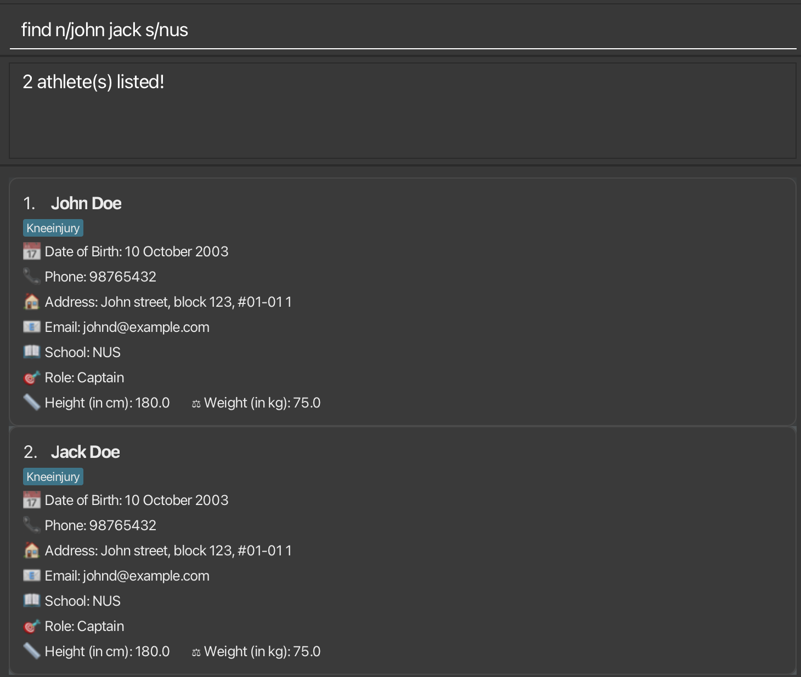
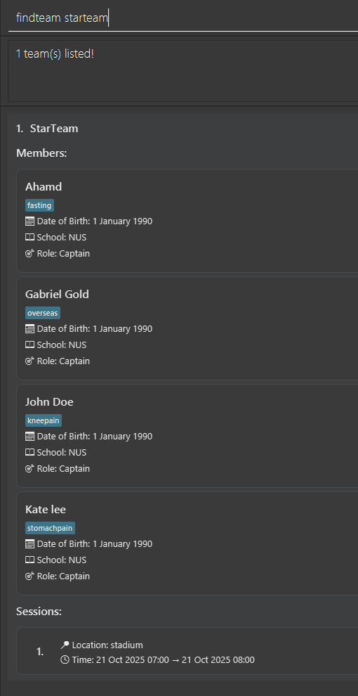
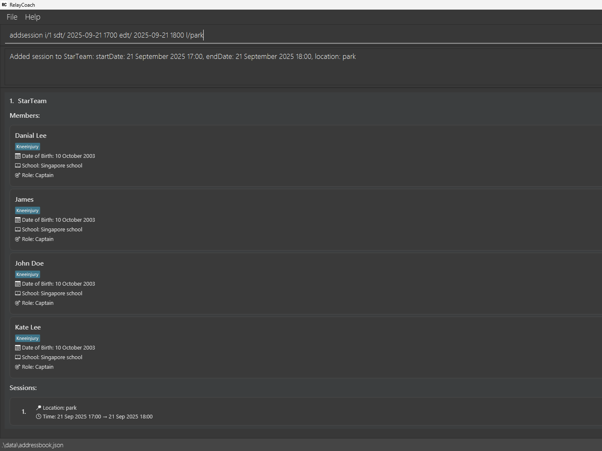

# RelayCoach User Guide

RelayCoach is a **desktop app designed for coaches to manage their relay athletes' contacts and training schedules**, optimized for use via a Command Line Interface (CLI) while still offering the benefits of a Graphical User Interface (GUI). If you can type fast, RelayCoach helps coaches complete athlete management tasks faster than traditional GUI apps.

<!-- * Table of Contents -->
<page-nav-print />

--------------------------------------------------------------------------------------------------------------------

## Quick start

1. Ensure you have Java `17` or above installed in your Computer. 
   **Mac users:** Ensure you have the precise JDK version prescribed [here](https://se-education.org/guides/tutorials/javaInstallationMac.html).

1. Download the latest `.jar` file from [here](https://github.com/AY2526S1-CS2103-F13-1/tp/releases).

1. Copy the file to the folder you want to use as the _home folder_ for your RelayCoach app.

1. Open a command terminal, `cd` into the folder you put the jar file in, and use the `java -jar relaycoach.jar` command to run the application. 
   A GUI similar to the below should appear in a few seconds. Note how the app contains some sample data. 
   

1. Type the command in the command box and press Enter to execute it. e.g. typing **`help`** and pressing Enter will open the help window. 
   Some example commands you can try:

   * `list`: Lists all athletes.

   * `add n/John Doe d/1990-01-01 p/98765432 e/johnd@example.com a/6 Haji Lane s/NUS r/Captain h/175 w/65 t/Injured`: Adds a contact named `John Doe` to the RelayCoach app.

   * `delete 3`: Deletes the 3rd contact shown in the current list.

   * `clear`: Deletes all data in the RelayCoach app.

   * `exit`: Exits the app.

1. Refer to the [Features](#features) below for details of each command.

--------------------------------------------------------------------------------------------------------------------

## Features

| **Parameter** | **Represents**                                                           | **Constraints**                                                                                                                                                                                                                                                                                                                                           |
|---|--------------------------------------------------------------------------|-----------------------------------------------------------------------------------------------------------------------------------------------------------------------------------------------------------------------------------------------------------------------------------------------------------------------------------------------------------|
| `NAME` | The name of the athlete                                                  | Must not be blank (only whitespaces). Can contain letters, spaces, hyphens (-), apostrophes ('), periods (.), slashes (/), commas (,), and parentheses ( ). Must be 1–80 characters long. Refer to [Notes about the command format](#notes-about-the-command-format) for slash usage.                                                                     |
| `DOB` | The date of birth of the athlete                                         | Must be a valid calendar date in `YYYY-MM-DD` format. Must not be blank (only whitespaces). Must not be a future date.                                                                                                                                                                                                                                    |
| `PHONE` | The phone number of the athlete                                          | Must not be blank (only whitespaces). Only numbers allowed. Must be 4–17 digits long.                                                                                                                                                                                                                                                                     |
| `EMAIL` | The email address of the athlete                                         | Must not be blank (only whitespaces). Must follow `local-part@domain`. `local-part`: alphanumeric + allowed special characters: plus (+), underscores (_), periods (.), hyphens (-) (cannot start/end with special character). `domain`: labels separated by periods, each starting/ending alphanumeric, optional hyphens. Must be 2–255 characters long. |
| `ADDRESS` | The address of the athlete                                               | Must not be blank (only whitespaces). Can contain letters, numbers, spaces, commas (,), periods (.), hyphens (-), apostrophes ('), slashes (/), ampersands (&), hash (#), semicolons (;​), parentheses ( ). Must be 1–255 characters long. Refer to [Notes about the command format](#notes-about-the-command-format) for slash usage.                    |
| `SCHOOL` | The school of the athlete                                                | Must not be blank (only whitespaces). Can contain letters, numbers, spaces, ampersands (&), hyphens (-), apostrophes ('), parentheses ( ), commas, periods (.). Must be 1–200 characters long.                                                                                                                                                            |
| `ROLE` | The role of the athlete                                                  | Must not be blank (only whitespaces). Can contain letters, numbers, spaces, hyphens (-), slashes (/), plus (+), underscores (_), parentheses (), apostrophes ('). Must be 1–150 characters long. Refer to [Notes about the command format](#notes-about-the-command-format) for slash usage.                                                              |
| `HEIGHT` | The height of the athlete in centimeters                                 | Must not be blank (only whitespaces). Accepts only a positive number between 50–300 cm, up to one decimal place.                                                                                                                                                                                                                                          |
| `WEIGHT` | The weight of the athlete in kilograms                                   | Must not be blank (only whitespaces). Accepts only a positive number between 25–200 kg, up to one decimal place.                                                                                                                                                                                                                                          |
| `TAG` | A tag describing additional information about the athlete                | **OPTIONAL**, but if provided, can contain letters, numbers, hyphens (-), slashes (/), plus (+), underscores (_), parentheses (), apostrophes ('). No spaces. Must be 1–100 characters long.                                                                                                                                                              |
| `INDEX` / `ATHLETE_INDEX` / `TEAM_INDEX` | The index referring to the entry shown in the displayed athlete/team list | Must not be blank (only whitespaces). Must be a positive integer (1, 2, 3, …).                                                                                                                                                                                                                                                                            |
| `TEAM_NAME` | The name of the team                                                     | Must not be blank (only whitespaces). Can contain letters, numbers, spaces, hyphens (-), apostrophes ('), periods (.), parentheses ( ). Must be 1–80 characters long.                                                                                                                                                                                     |
| `STARTDATETIME` / `ENDDATETIME` | Session start/end date and time                                          | Must be a valid calendar date/time in `YYYY-MM-DD HHmm`. Must not be blank (only whitespaces).                                                                                                                                                                                                                                                            |
| `LOCATION` | Represents a session's location                                          | Must not be blank (only whitespaces). Can contain letters, numbers, spaces, commas (,), periods (.), hyphens (-), apostrophes ('), slashes (/), ampersands (&), hash (#), semicolons (;​), parentheses ( ). Must be 1–255 characters long. Refer to [Notes about the command format](#notes-about-the-command-format) for slash usage.                    |

<box type="info" seamless>

### Notes about the command format

* Words in `UPPER_CASE` are the parameters to be supplied by the user. 
  e.g. in `add n/NAME`, `NAME` is a parameter which can be used as `add n/John Doe`.

* In the User Guide, items in square brackets are optional. 
  e.g `n/NAME [t/TAG]` can be used as `n/John Doe t/friend` or as `n/John Doe`.

* Items with `…`​ after them can be used multiple times including zero times. 
  e.g. `[t/TAG]…​` can be used as ` ` (i.e. 0 times), `t/friend`, `t/friend t/family` etc.

* Parameters can be in any order. 
  e.g. if the command specifies `n/NAME p/PHONE_NUMBER`, `p/PHONE_NUMBER n/NAME` is also acceptable.

* Extraneous parameters for commands that do not take in parameters (such as `help`, `list`, `exit` and `clear`) will be ignored. 
  e.g. if the command specifies `help 123`, it will be interpreted as `help`.

* Missing required prefixes or including additional/invalid prefixes will result in an invalid command error prompt. 
  e.g. `add John Doe p/98765432` (missing `n/`) or `add n/John Doe x/extra` (invalid prefix) will both be rejected.

* **Slash usage** - Literal input prefix escape using angle brackets `< >`: 
  - If your input contains text that resembles a prefix (e.g. `n/`, `s/`) **immediately after a whitespace**, wrap it in angle brackets to treat it as literal input rather than a command prefix. 
    - Example:
    `edit 1 n/John <s/o> Doe` → Name becomes `John s/o Doe` 
  - Angle brackets are removed during processing, letting you safely include slashes in text fields.

  - If the slash is **not** part of a prefix after whitespace, no angle bracket wrapping is required: 
    - Example: `edit 1 n/John abcdef/ Doe` → Name becomes `John abcdef/ Doe`

  - **Important:** Angle brackets must be properly closed — lone `<` or `>` will not be accepted.

  - **Why this exists:** RelayCoach uses prefixes like `n/` and `s/` to identify fields.  
    - Without angle brackets, `edit 1 n/John s/o Doe` would be interpreted as:
      - `n/John` → Name = `John`
      - `s/o Doe` → School = `o Doe`

* If you are using a PDF version of this document, be careful when copying and pasting commands that span multiple lines as space characters surrounding line-breaks may be omitted when copied over to the application.
</box>

### Viewing help: `help`

Shows a message explaining how to access the help page.

Format: `help`

### Adding an athlete: `add`

Adds an athlete to the RelayCoach app.

Format: `add n/NAME d/DOB p/PHONE e/EMAIL a/ADDRESS s/SCHOOL r/ROLE h/HEIGHT w/WEIGHT [t/TAG]…​`

<box type="tip" seamless>

**Tip:** An athlete can have any number of tags (including 0).
</box>

<box type="tip" seamless>

**Tip:** Duplicate athletes are not allowed in RelayCoach. Two athletes are considered duplicates if they have the same name and date of birth.
</box>

Examples:
* `add n/John Doe d/1990-01-01 p/98765432 e/johnd@example.com a/6 Haji Lane s/NUS r/Captain h/175 w/65 t/Injured`
* `add n/Betsy Crowe d/1988-05-12 p/81234567 e/betsyc@gmail.com a/123, Yishun Ave 2, #10-355 s/SMU r/Runner h/160.5 w/50.0`

### Listing all athletes: `list`

Shows a list of all athletes in the RelayCoach app.

Format: `list`

### Editing an athlete: `edit`

Edits an existing athlete in the RelayCoach app.

Format: `edit INDEX [n/NAME] [d/DOB] [p/PHONE] [e/EMAIL] [a/ADDRESS] [s/SCHOOL] [r/ROLE] [h/HEIGHT] [w/WEIGHT] [t/TAG]…​`

* Edits the athlete at the specified `INDEX`. The index refers to the index number shown in the displayed athlete list. 
  The index **must be a positive integer** 1, 2, 3, …​
* At least one of the optional fields must be provided.
* Existing values will be updated to the input values.
* When editing tags, the existing tags of the athlete will be removed i.e adding of tags is not cumulative.
* You can remove all the athlete’s tags by typing `t/` without
    specifying any tags after it.

<b>Warning:</b> Changes made to an athlete will automatically update in the team (if any) that include this athlete.

Examples:
*  `edit 1 p/91234567 e/johndoe@example.com` Edits the phone number and email address of the 1st athlete to be `91234567`
  and `johndoe@example.com` respectively.
*  `edit 2 n/John Doe t/` Edits the name of the 2nd athlete to be `John Doe` and clears all existing tags.

### Finding athletes by name, school, role or tag: `find`

Finds athletes whose fields match the provided keywords for that field.

Format: `find [n/NAME] [s/SCHOOL] [r/ROLE] [t/TAG]` (must provide at least one field)

* The search is case-insensitive. e.g `hans` will match `Hans`
* The order of the keywords does not matter. e.g. `Hans Bo` will match `Bo Hans`
* Only full words will be matched e.g. `Han` will not match `Hans`
* Only persons matching all fields provided will be returned (i.e. `AND` search).
* Within each field, persons matching any of the keywords will pass the predicate (i.e. `OR` check).

Examples:
* `find n/John` returns `john` and `John Doe`
* `find n/john jack s/NUS` returns `John Doe`, `Jack Doe`, both with School: NUS 
  

### Deleting an athlete: `delete`

Deletes the specified athlete by index from the displayed athlete list.

Format: `delete INDEX`

* Deletes the athlete at the specified `INDEX`.
* The index refers to the index number shown in the displayed athlete list.
* The index **must be a positive integer** 1, 2, 3, …​

<b>Warning:</b> If the deleted athlete was part of a team, that team will also be deleted automatically.

Examples:
* `list` returns a list of all athletes, followed by `delete 2` which deletes the 2nd athlete in the list.
* `find n/John` returns a list of athletes named John, followed by `delete 1` which deletes the 1st athlete in that list.

### Adding a team: `team`

Adds a new team with no sessions to the RelayCoach app.

Format: `team tn/TEAM_NAME i/ATHLETE_INDEX_1 ATHLETE_INDEX_2 ATHLETE_INDEX_3 ATHLETE_INDEX_4` 

<box type="tip" seamless>

**Tip:** Exactly 4 unique athlete IDs must be provided to form a team. Each athlete can only be part of exactly one team.
</box>

Examples:
* `team tn/StarTeam i/1 2 3 4`: Adds a new team named `StarTeam` with athletes at indexes 1, 2, 3, 4 in the displayed athlete list as members.

### Listing all teams: `listteams`

Shows a list of all teams in the RelayCoach app.
Each team contains a list of 4 members, and a list of training sessions scheduled for the team.

Format: `listteams`

### Locating teams: `findteam`

Finds teams whose name matches the provided keywords.

Format: `findteam TEAM_NAME [MORE_TEAM_NAMES]` (must provide at least one name keyword)

* The search is case-insensitive. e.g `starteam` will match `StarTeam`
* The order of the keywords does not matter. e.g. `StarTeam MoonTeam` will match `MoonTeam StarTeam`
* Only the team name is searched
* Only full words will be matched e.g. `Star` will not match `StarTeam`
* Teams matching at least one keyword will be returned (i.e. OR search). e.g. `Starteam MoonTeam` will return `StarTeam`, `MoonTeam`

Examples:
* `findteam starteam` returns `StarTeam`
* `findteam starteam moonteam` returns `StarTeam` , `MoonTeam` 
  

### Deleting a team: `deleteteam`

Deletes the specified team at a given index from the displayed team list.

<b>Warning:</b> Deleting a team deletes all sessions associated with that team as well.

Format: `deleteteam INDEX`

Examples:
* `listteams` followed by `deleteteam 1` deletes the 1st team in the teams list from the RelayCoach app.

### Adding Session: `addsession`

Adds a session to the team at a specified index from the displayed team list.

Format: `addsession i/TEAM_INDEX sdt/STARTDATETIME edt/ENDDATETIME l/LOCATION`

* `startDateTime` must be earlier than `endDateTime`.
* **No overlapping sessions** are allowed for the same team. Two sessions overlap if `startA < endB` **and** `startB < endA`. **Back‑to‑back is allowed** (i.e. `endA == startB`).
* Exact duplicates (same start, end, and location ignoring case) are rejected.

Examples:
* `addsession i/1 sdt/ 2025-09-21 1700 edt/ 2025-09-21 1800 l/park` adds a session to the team at index 1 (`StarTeam`) with start date & time: 21 September 2025 17:00, end date & time: 21 September 2025 18:00, and location: park
  
* `addsession i/1 sdt/ 2025-09-21 1800 edt/ 2025-09-21 1900 l/park` is **allowed** (back‑to‑back with the previous session), while `addsession i/1 sdt/ 2025-09-21 1759 edt/ 2025-09-21 1830 l/park` will be **rejected** because it overlaps.

### Deleting Session: `deletesession`

* Deletes the session at a specified session index from the team at a specified team index in the displayed team list.

Format: `deletesession i/TEAM_INDEX si/SESSION_INDEX`

Examples:
* `deletesession i/1 si/1` deletes the 1st session from the team at index 1

### Clearing all entries: `clear`

Clears all entries from the RelayCoach app.

Format: `clear`

### Exiting the program: `exit`

Exits the program.

Format: `exit`

### Saving the data

RelayCoach data are saved in the hard disk automatically after any command that changes the data. There is no need to save manually.

### Editing the data file

RelayCoach data are saved automatically as a JSON file `[JAR file location]/data/relaycoach.json`. Advanced users are welcome to update data directly by editing that data file.

<box type="warning" seamless>

**Caution:**
If your changes to the data file makes its format invalid, RelayCoach will discard all data and start with an empty data file at the next run.  Hence, it is recommended to take a backup of the file before editing it. 
Furthermore, certain edits can cause RelayCoach to behave in unexpected ways (e.g., if a value entered is outside the acceptable range). Therefore, edit the data file only if you are confident that you can update it correctly.
</box>

--------------------------------------------------------------------------------------------------------------------

## FAQ

**Q**: How do I transfer my data to another Computer? 
**A**: Install the app in the other computer and overwrite the empty data file it creates with the file that contains the data of your previous RelayCoach home folder.

--------------------------------------------------------------------------------------------------------------------

## Known issues

1. **When using multiple screens**, if you move the application to a secondary screen, and later switch to using only the primary screen, the GUI will open off-screen. The remedy is to delete the `preferences.json` file created by the application before running the application again.
2. **If you minimize the Help Window** and then run the `help` command (or use the `Help` menu, or the keyboard shortcut `F1`) again, the original Help Window will remain minimized, and no new Help Window will appear. The remedy is to manually restore the minimized Help Window.

--------------------------------------------------------------------------------------------------------------------

## Command summary

| Action            | Format, Examples                                                                                                                                                                                                                 |
|-------------------|----------------------------------------------------------------------------------------------------------------------------------------------------------------------------------------------------------------------------------|
| **Add**           | `add n/NAME d/DOB p/PHONE e/EMAIL a/ADDRESS s/SCHOOL r/ROLE h/HEIGHT w/WEIGHT [t/TAG]…​`   e.g., `add n/John Doe d/1990-01-01 p/98765432 e/johnd@example.com a/6 Haji Lane s/NUS r/Captain h/175 w/65 t/Injured t/Vegetarian` |
| **AddSession**    | `addsession i/TEAM_INDEX sdt/STARTDATETIME edt/ENDDATETIME l/LOCATION`  e.g., `addsession i/1 sdt/ 2025-09-21 1700 edt/ 2025-09-21 1800 l/park`. No overlapping sessions are allowed; back‑to‑back is allowed.                |
| **Clear**         | `clear`                                                                                                                                                                                                                          |
| **Delete**        | `delete INDEX`  e.g., `delete 3`                                                                                                                                                                                              |
| **DeleteSession** | `deletesession i/TEAM_INDEX si/SESSION_INDEX`   e.g., `deletesession i/1 si/2`                                                                                                                                                |
| **DeleteTeam**    | `deleteteam INDEX`   e.g., `deleteteam 2`                                                                                                                                                                                     |
| **Edit**          | `edit INDEX [n/NAME] [d/DOB] [p/PHONE] [e/EMAIL] [a/ADDRESS] [s/SCHOOL] [r/ROLE] [h/HEIGHT] [w/WEIGHT] [t/TAG]…​`   e.g.,`edit 2 n/James Lee e/jameslee@example.com`                                                          |
| **Find**          | `find [n/NAME] [s/SCHOOL] [r/ROLE] [t/TAG]`  e.g., `find n/John Jack s/NUS`                                                                                                                                                   |
| **FindTeam**      | `findteam TEAM_NAME [MORE_TEAM_NAMES]`  e.g., `findteam starteam sunteam`                                                                                                                                                     |
| **Help**          | `help`                                                                                                                                                                                                                           |
| **List**          | `list`                                                                                                                                                                                                                           |
| **ListTeams**     | `listteams`                                                                                                                                                                                                                      |
| **Team**          | `team tn/TEAM_NAME i/ATHLETE_INDEX_1 ATHLETE_INDEX_2 ATHLETE_INDEX_3 ATHLETE_INDEX_4`   e.g., `team tn/StarTeam i/1 2 3 4`                                                                                                    |
